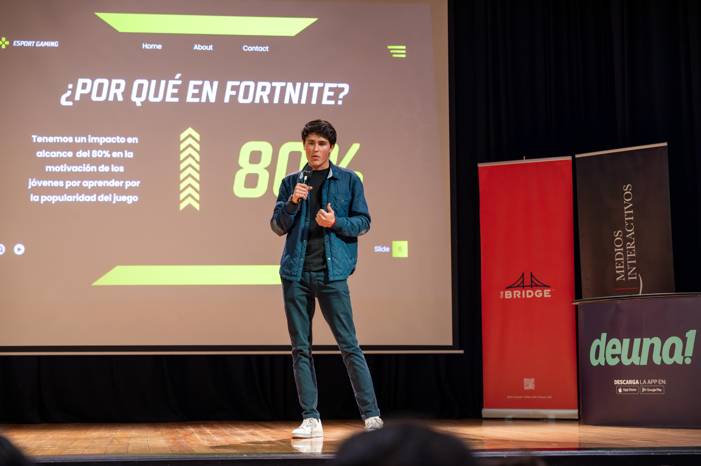

# GABRIEL CALDERÓN 👨‍💻
### Software Engineering Student | Data Analyst | Social Impact Leader

  
  

---

---

### 👋 About Me

I am a Software Engineering student (GPA: 9.43/10) with professional experience in data analysis for financial fraud prevention. Currently, I am a **Data Analyst Intern at Diners Club Ecuador**, where I analyze transactional datasets using Python to identify anomalous patterns and improve fraud detection models.

I am passionate about building secure, efficient, and purpose-driven technological solutions. I thrive in environments where I can lead, innovate, and contribute to high-impact projects, especially those aligned with social and environmental sustainability.

---

### 🚀 My Journey

A timeline of my key milestones, from most recent to oldest.

* **May 2025:** 📊 Started my **Data Analyst & Cyber Fraud internship at Diners Club Ecuador**.
* **May 2025:** 👩‍🏫 Mentored a team at **Educatón 2025**, a national initiative to promote women in STEM.
* **2025:** 🏆 Won **1st Place at the "Interact2Hack" Hackathon** hosted by Universidad San Francisco de Quito.
* **Late 2024:** 🌍 Organized a **Hackathon focused on the UN's Sustainable Development Goals**, attracting over 100 participants and generating 20+ tech solutions.
* **Nov 2024:** 🏛️ Elected **President of the Faculty of Engineering and Applied Sciences**.
* **2023:** 🎓 Began my Software Engineering degree at Universidad de las Américas.
* **Mar 2027:** ✨ Expected Graduation.

---

### 🛠️ My Tech Stack

These are the technologies I work with. I'm always eager to learn more!

**My Toolkit:**

  

**Currently Learning:**

  

---

### 🌟 Featured Projects

Here are some of the projects I'm most proud of.

#### 🥇 Cyber Grid - Quantitative Risk Analysis System
* **Description:** A comprehensive system built on a microservices and event-driven architecture. It performs a quantitative risk analysis based on a web domain and the user's risk appetite, calculating asset values and potential vulnerabilities. The core logic is powered by a **50-page quantitative risk analysis methodology** our team developed.
* **Link:** *https://github.com/G4B0CM/auth_service*
* **Tech Stack:** *

  

*

#### 🥈 Vulnerability Analysis System
* **Description:** A full-stack system that provides a quantitative score for a web domain's vulnerabilities using an innovative methodology our team developed.
* **Tech Stack:** Python, Node.js, React.
* **Link:** *https://github.com/G4B0CM/vulnerability-scanner-service*

#### 🥉 Order Management System
* **Description:** A full-stack web system developed to manage the complete lifecycle of customer orders for a real company. It features automated client notifications via the WhatsApp API.
* **Tech Stack:** Java, WhatsApp API, Google Maps API.

---

### 🏆 Leadership & Achievements

* **Faculty President:** Led a 20-member team to execute a high-impact hackathon on Sustainable Development Goals, fostering a stronger bond between academia and the community.
* **Hackathon Winner:** Achieved **first place** in the "Interact2Hack" at Universidad San Francisco de Quito.
* **STEM Mentor:** Guided a team of young women in the Educatón 2025 hackathon, focusing on the project lifecycle, value proposition, and scalability, in support of gender inclusion in technology.
* **Continuous Learner:** I have earned over **[25+ professional certifications](https://drive.google.com/drive/folders/1Jz6BeVvQRxF56KxRJ4avgl22H--s7sdf?usp=sharing)** from platforms like Coursera and Udemy.

---

### 📊 My GitHub Stats

  
  

